# Automation Center

## Introduction

ServiceNow® Automation Center application can be used to govern your end-to-end multi-vendor automation life cycles from one place. By using real-time dashboards, you can manage and measure the health of the automation and prevent automation failures across multiple vendors​.

Key features:

- Discover, prioritize, and manage automation requests from different sources through the full life cycle in Automation Center workspace.
- Oversee and optimize automation performance versus business goals across multiple vendors.
- Monitor and manage the health of the automation and prevent automation failures across multiple vendors.

## Goal

In this exercise you will gain understanding of ServiceNow's Automation Center offering to help drive the various activities normally managed by Automation CoE (Center of Excelence). You will see how process owners can submit request for automation, and how an Automation CoE team can use **Automation Center** to track, drive, coordinate and reports on all automation activities related to an automation request wether or not the automation is performed on the ServiceNow platform or not.

For our particular use case, the Process Owner who owns the **Setup Direct Deposit** process from Payroll has identified some bottlenecks in the process (Using Process Optimization on ServiceNow - Process Mining capability). In this Lab we will see how the Process Owner can submit an Automation Request to the Automation CoE (In an attempt to drive efficiency by automating manual tasks), then we will see how an Automation CoE team can use Automation Center to review, and work on the Automation Request as well as managing and tracking all the activities related to building the automation for that request.

## Submitting an Automation Request

In this section of lab you will submit an automation request and review an existing one. we are going to walk you through the screens of Automation Center to help you understand what it does and how it works.

1. Log in to your instance as **Admin** then click on **Favorites** (1) then on **Submit an Automation Request** (2). (You might have to scroll down to see it at the bottom of the list)

    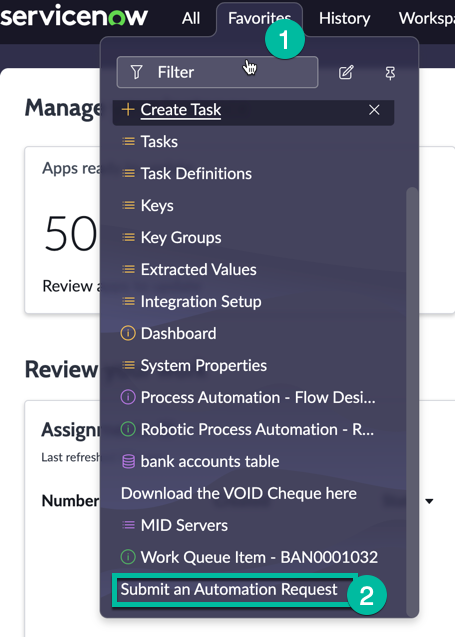

    Typically a Process Owner that have identified a need for automation will go here to submit an Automation Request. In our scenario, it could be the Process Owner who owns the 'Setup Direct Deposit' Process. By submitting a request the Process Owner can share detail about the process and the need for automation. The Automation COE would then review the request, vet it, and priorities that request.

1. The **Submit an Automation Request** form should look as shown in the picture below. Note that this is an out of the box form that comes with Automation Center.

    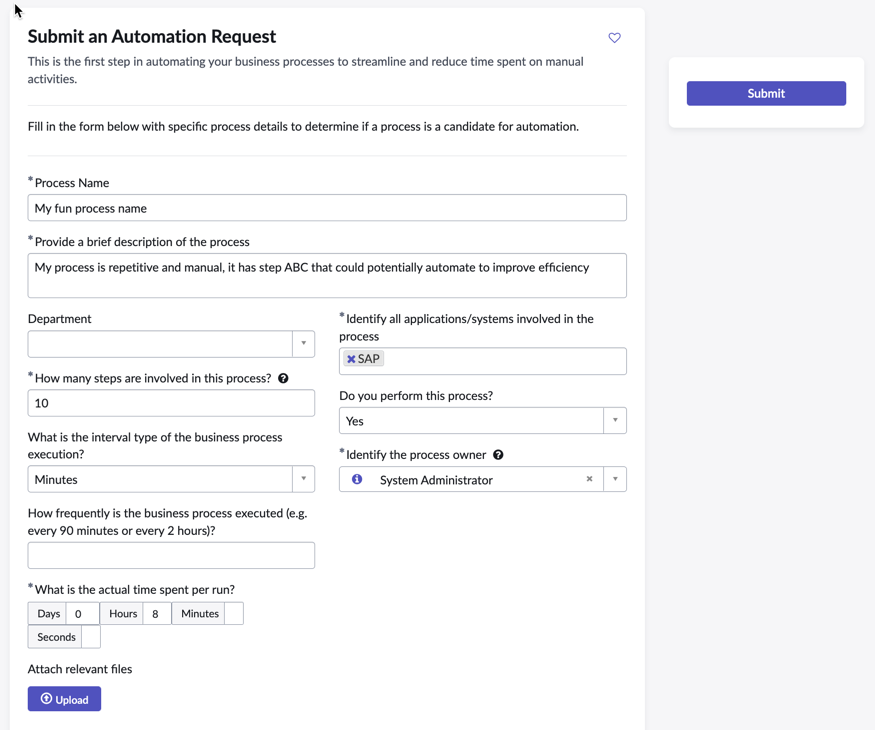

   
1. Fill out the form with those information (We are just showing how to submit the request, it does not matter what you type on that form for the exercice).
This form is used to gather as much information we can about the process so the Automation team can them estimate effort and/or prioritize the automation tasks accordingly.

    | Field| Value |
   |-------|-------|
   | 1. Process Name | My fun process name |
   | 2. Provide a brief description | my process ABC... |
   | 3. Identify all applications/Systems involved in the process | SAP |
   | 4. How Many steps are involved in this process | 10 |
   | 5. Do you perform this process | Yes |
   | 6. Identify the process owner | System Administrator |

    Notice on the form that the user has the ability to attach any relevant files that would help the Automation team understand the process to automate. It can be process documentation, screenshots, recording of manual steps etc: 

     

1. Once you have filled out the form click **submit** to submit your request to the Automation COE team

    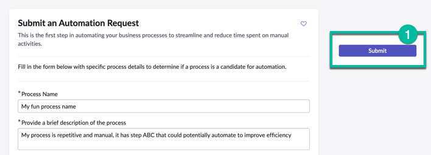

    Now that we have submitted an Automation Request, It is time to review it as if we were the Automation COE team using Automation Center to track those requests and review them.

## Automation Center Workspace overview

Automation COE teams can prioritize, and manage automation requests from different sources through the full life cycle in Automation Center workspace. In this section of the lab we are going to review an Automation Request and explain the different concepts related to it.

1. Like an Automation CoE team would do, we are going to review the automation request from the **Automation Center Workspace**. 
 
    From your instance, Click **All** (1) then type **automation center** (2) then click **Automation Center Home** (3) to open the Automation Center Workspace.

    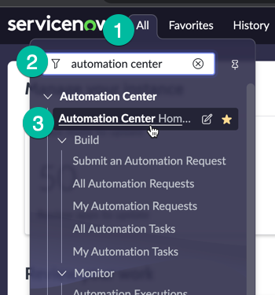

    The landing page of Automation Center shows a lot of useful information for the Automation CoE lead to oversee goals, performance, and pipeline. It provides the big picture and helps visualize benchmarks for automation business goals and activity in one place.

1.  Review the Automation Goals - The **Automation Goals** section shows the progress automation goals, What has already been achieved, what is going well, what can be improved. The progress is shown only for the goals that are associated with a request from the current year. Feel free to click the numbers on the goals widgets to view the data and filters:

    

1. Scroll down to until you see the Active Automations information, we are going to change the date on the filter to make sure the widgets has demo data to show. Click on (1) **Date:** filter, then on (2) change the value to **Last 3 months** and click **Apply** (3) as showm below:

    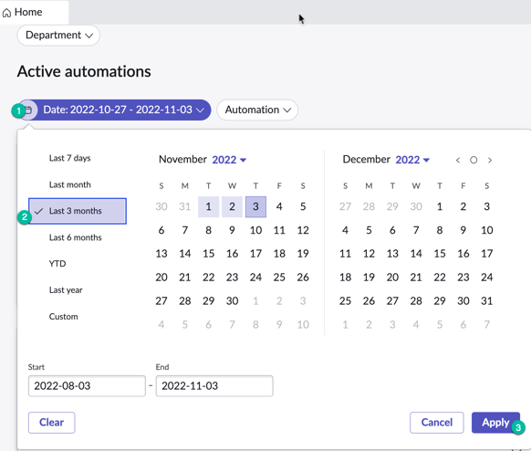

    Those widgets report of deployed automations by business, job summaries, cost savings, and time savings.

    

    > The Cost Saving and Time Savings are not showing any data because we do not have the right Demo Data on those lab instances right now.

    > Clicking the Cost savings and Time savings widgets opens the Analytics Hub KPI Details widget in a new tab. There is no demo data for it right now.

1. Scroll down until you see **Robotic Process Automation (RPA) by source** and **Top 10 applications used** as shown:

    The first widget (1) report RPA jobs by status in the last 7 days. The RPA solution does not have to be the ServiceNow RPA, Automation COE teams can use Automation Center to collect and reports automation data from other 3rd party Automaiton solutions.

    Under **Top 10 Application used** (2),by default the widget reports the top 10 business applications used. We are able to bring the visility into Applications that are used by automation because directly from the **Automation Request** we can link that Automation Request to one or many Business Application(s) (Business Application that are referenced in the CMDB)

    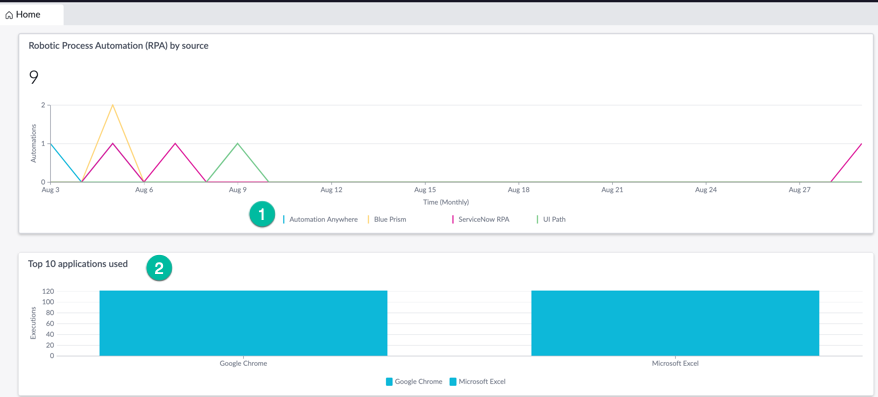

    Scroll down until you see **Future Automations**:

    This is where the Automation COE team can see their pipeline of automation requests by intake source and request to be deployed.

    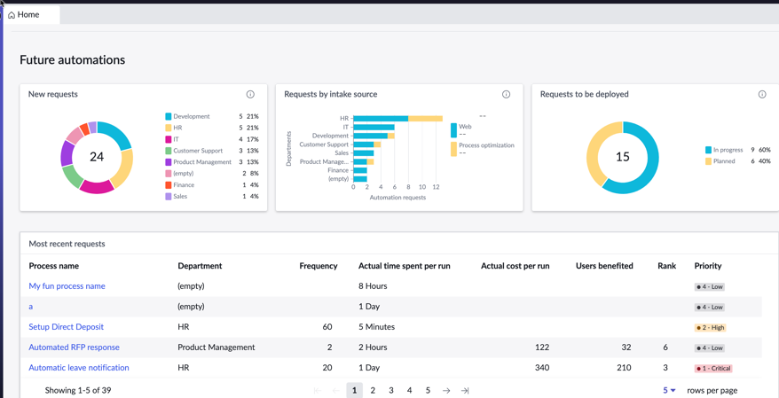

    Automation Center is also able to collect and report on Automation Execution, from ServiceNow's RPA solution but we also provide a framework and datamodel to allow customer to collect data from 3rd Party Automation solution To fetch execution data from 3rd party solution this would involve mostly buidling a flow in Flow Designer to collect data from an API in order to populate the sn_ac_automation_execution table.

    At the top of the Automation Center pager locate the and click the **Executions** Tab as shown: 

    

    The first for widgets provide visibility into Executions Jobs, Automation Incident, Automation Changes and Business Application Changes, this are very valuable information for when organization run Automation at scale, we are able to provide this level of detail because ServiceNow Incident, Problem, Change (ITSM) run on the same platform has one single datamodel

    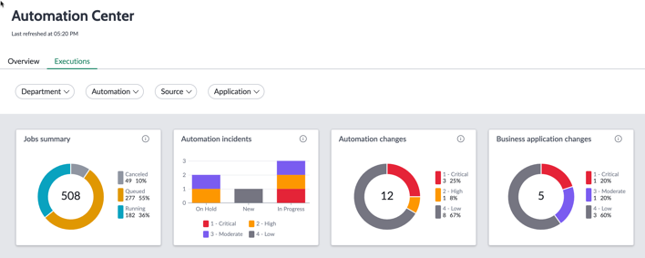

    Click in the blue portion of the Circle Chart on the Job summary widget as shown to open the view that shows the running executions: 

   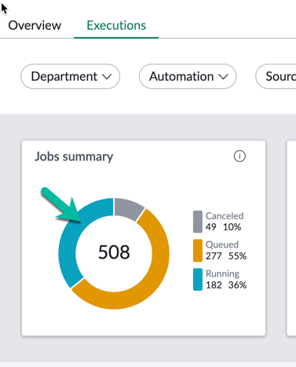

    Notice the source column, Automation Center shows the running Automation executions from 3rd party RPA solution:

   

   > The date displayed on the view comes from the sn_ac_automation_execution table on the platform, metadata from 3rd party automation tool are stored in that table

   After looking at the **Job Summaryy** view, you can now close that tab as shown below:

    

    Now that we have reviewed the **Automation Center Dashboard**, lets review an Automation Request

1.  From the Automation Center Workspace, click on the List icon (1), then click **All Automation Request** (2), then locate the Automation request (3)  **ATR0002003 - Setup Direct Deposit** and click on it to open it

    

    This is where an Automation COE team member would go to review an **Automation Request**, manage and track all the activities from the technical requirement gathering, development, testing and execution of the automation.

    As you can see from that screen, the Automation team can review all the detail that was submitted by the Process Owner in the Automation Request:

    

    > Notice the **Application used** field it contain the Business Application from the CMDB. This is very useful information for the Automation Team so if they need to identify the application Owner or get information about the systems to automate, it's all in the CMDB!

    This give a good overview of the ask from the Process Owner, from that Automation Request, the Automation Team can then start planning the different activities to deliver the automation, click on the **Tasks** tab as shown to review them

    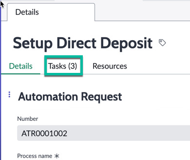

    You should see a list of 3 tasks, this is where the Automation CoE can orchestrate and manage all the activities required to build the automation. They can create tasks and assign them to differents teams (based on the requirements gathered in the Automation Request) Often time building Automation takes differents skillset such as Integration, RPA, Workflow development, or even the team responsible for the application we need to automate.  It can be many different teams involved in the process. Automation Center help manage that.

    Click on the Automation Task number **ARSK0001015** to open it:

    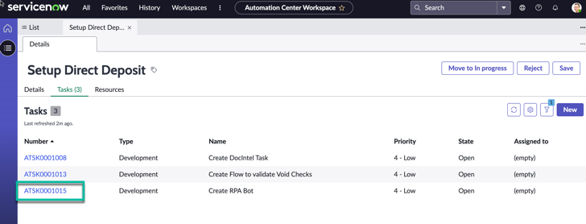

    You can see you can set a priority, Due Date and Assign the task to a Team or a person. Lets Assign this task to the RPA Team so they can start working on building a Robot in RPA to automate that legacy HR/Payroll app!

    1. We are going to set an Assignment group the a team can start workin on this task

    

    Locate the **Assignment group** field (1)  Type **RPA Team** (2) to search for the rpa team on the list, then select the value **RPA Team** from the list (3) and click **Save** (4):

    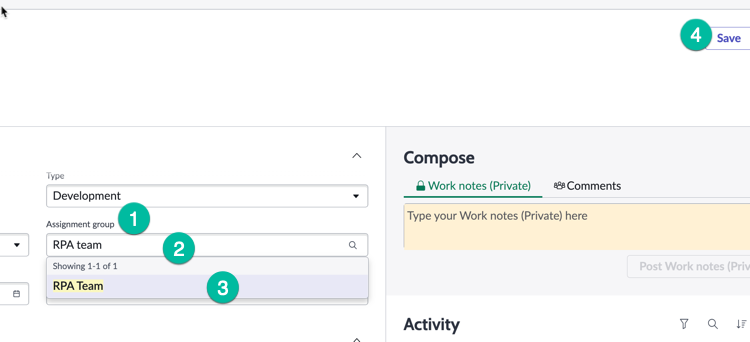

    The RPA Team now will see that they have a new task assigned to them and can start working on it. 

    Close that tab by clicking on the x next to **Create RPA Robot** as shown: 

    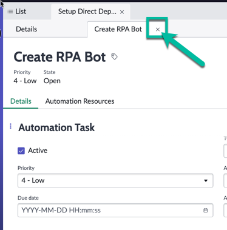

    As an Automation CoE, you can mark that Automation Request as **In Progress** so the Process Owner who submitted the request knows that the team is working on it (Notification can be configured on the platform). Click on the **Move to In progress** button as shown below: 

    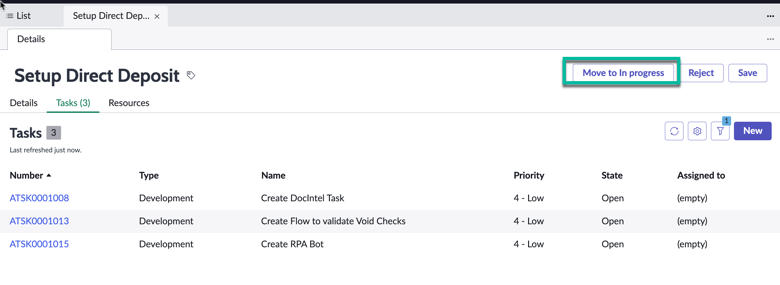

## Conclusion

In this **Automation Center** lab, we have seen how an Automation CoEs can use Automation Center to govern their end-to-end multi-vendor automation life cycles from one place. We have seen how the automation request can be funnel from (Service Catalog Request), reviewed and vetted from the Automation Center workspace. Also with the Automation Center dashboard, we have seen how Automation CoEs ca can view real-time metrics and analytics for their Automation activities indenpendtly of the automation tools used for their projects.

